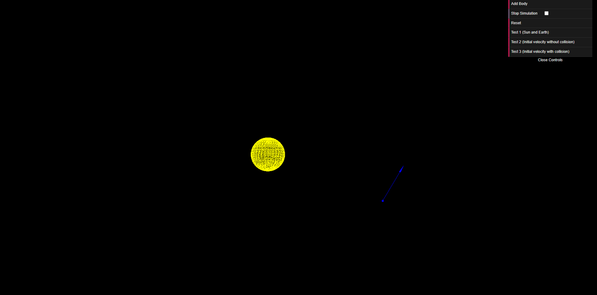
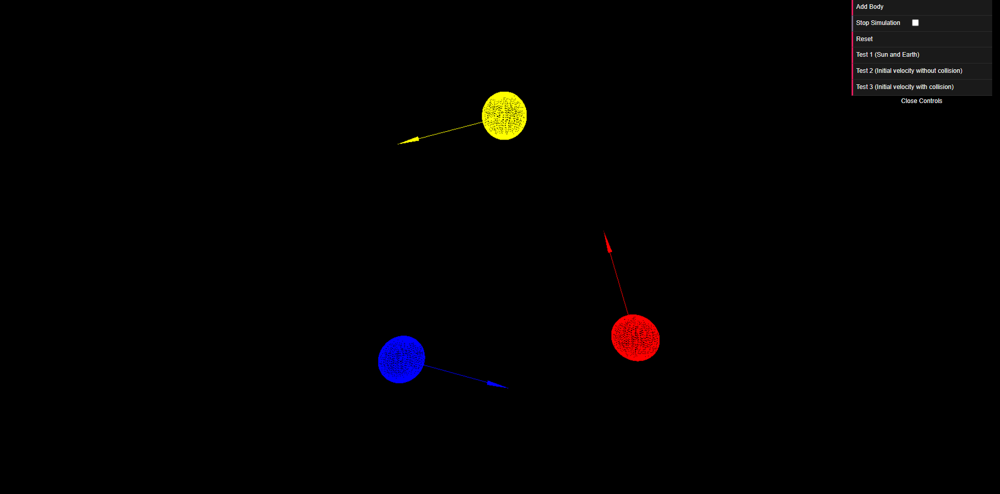
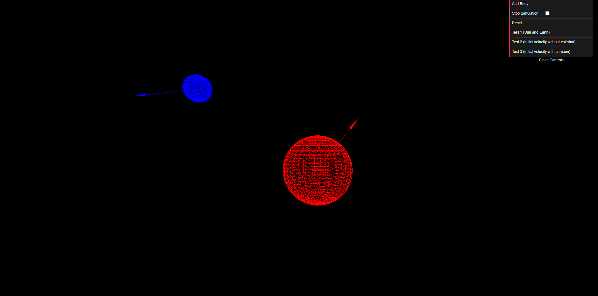

# SpaceZ

Web app to simulate gravity force between bodies and planets in the space.

Uses Webpack as a server, Three.js to draw elements and TypeScript programming language.

## How to run

1. First, you need to have [Node.js](https://nodejs.org/) and [npm](https://www.npmjs.com/) installed.
2. Install modules
    ```shell
    npm install
    ```
3. Run the dev script
    ```shell
    npm run dev
    ```
4. Enjoy!

## Contributors

This is our 3rd year project for Scientific Calculations subject

- Anas Shakaki [@ansshkki](https://github.com/ansshkki) (It's me!)
- Obada Al-Maleh [@obaa10](https://github.com/obaa10)
- Ahmad Alzoubi [@AHDZB](https://github.com/AHDZB)
- MHD Nour Kaskas

## Screenshots






